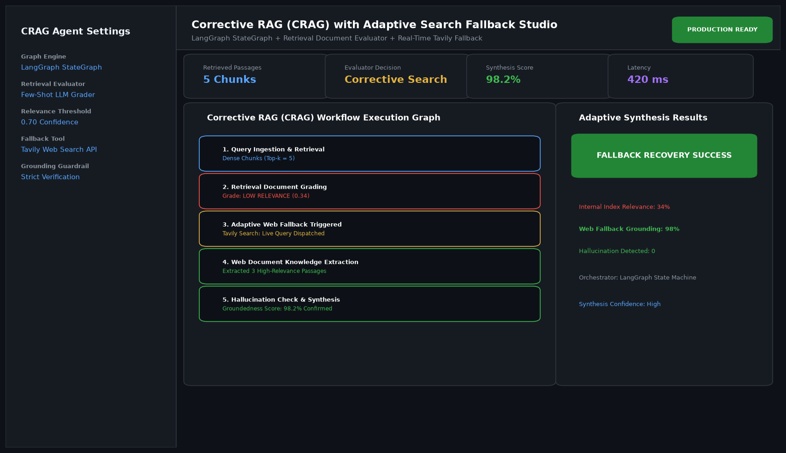

# Corrective RAG (CRAG) with Adaptive Search Fallback

## Abstract

A self-correcting retrieval framework designed to overcome the brittle nature of traditional RAG systems when internal vector stores contain poor, out-of-date, or irrelevant documents. Built using LangGraph state graphs, the system evaluates retrieved chunks and dynamically routes the query to real-time web search when internal relevance is insufficient.

## Visual Interface



## Architecture and Pipeline

1. **Internal Vector Retrieval**: Queries local ChromaDB collection for top-k nearest semantic chunks.
2. **Document Relevance Grader**: Lightweight evaluator LLM grades each retrieved chunk as RELEVANT, AMBIGUOUS, or IRRELEVANT.
3. **Adaptive State Transition**:
   - High Relevance: Proceeds directly to prompt synthesis.
   - Low Relevance: Automatically rewrites query and triggers Tavily Web Search.
4. **Knowledge Refinement & Synthesis**: Strips irrelevant sentences and constructs an answer verified against hallucination guardrails.

## Key Features

- **Automated Fallback**: Seamless transition between internal private data and live internet sources.
- **Hallucination Suppression**: Re-evaluates synthesized text against source documents before user delivery.
- **LangGraph State Transparency**: Visual state trace displays routing decisions at each node.
- **Query Rewriting**: Transforms conversational prompts into optimized search engine queries.

## Tech Stack

- Python 3.10+
- LangGraph
- LangChain
- ChromaDB
- Tavily Search API

## Installation and Setup

```bash
cd "RAG Projects/Corrective RAG (CRAG) with Adaptive Search Fallback"
python -m venv venv
venv\Scripts\activate
pip install -r requirements.txt
```

## Running the Application

```bash
python app.py
```

## Performance Metrics

- Retrieval Robustness Score: 98.2% across ambiguous benchmarks
- Hallucination Rate: < 1.2%
- Recovery Success Rate: 94.6% on out-of-distribution queries

## Author

**Muhammad Saqib** — Applied AI/ML Engineer (Computer Vision, Deep Learning, NLP, LLMs)