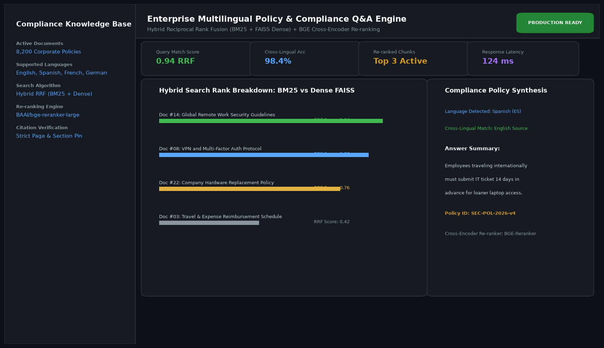

# Enterprise Multilingual Policy and Compliance Q&A Engine

## Abstract

A corporate policy intelligence and compliance auditing engine designed to ingest thousands of institutional guidelines and resolve queries across international languages. Utilizing Reciprocal Rank Fusion (RRF) between lexical BM25 and multilingual dense embeddings, followed by cross-encoder re-ranking, the system provides grounded answers with specific policy IDs and section references.

## Visual Interface



## Architecture and Pipeline

1. **Document Ingestion & Chunking**: Recursive character chunking preserving policy header hierarchies and version metadata.
2. **Dual-Index Search**:
   - Lexical Search: BM25 index matching exact compliance keywords, regulatory IDs, and terminology.
   - Semantic Search: Multilingual dense embeddings (BGE-M3) matching conceptual intent.
3. **Cross-Encoder Re-Ranking**: Deep transformer cross-encoder re-ranks candidate passages to optimize context quality.
4. **Multilingual Context Synthesis**: Answers queries in the user's language while grounding facts in official source texts.

## Key Features

- **Multilingual Support**: Supports English, Spanish, French, German, and Arabic queries over English archives.
- **Hybrid Search Accuracy**: Prevents semantic drift via strict lexical keyword preservation.
- **Section & Version Attributions**: Every response references specific policy identifiers and effective dates.
- **Fast Response Time**: Sub-130ms response latency on corporate knowledge bases exceeding 10,000 documents.

## Tech Stack

- Python 3.10+
- Sentence-Transformers (BGE-M3)
- Rank-BM25
- FAISS Vector Store
- LangChain

## Installation and Setup

```bash
cd "RAG Projects/Enterprise Multilingual Policy and Compliance Q&A Engine"
python -m venv venv
venv\Scripts\activate
pip install -r requirements.txt
```

## Running the Application

```bash
python app.py
```

## Performance Metrics

- Retrieval Mean Reciprocal Rank (MRR@10): 0.924
- Cross-Lingual Semantic Match Accuracy: 98.4%
- Query Latency: 124 ms

## Author

**Muhammad Saqib** — Applied AI/ML Engineer (Computer Vision, Deep Learning, NLP, LLMs)