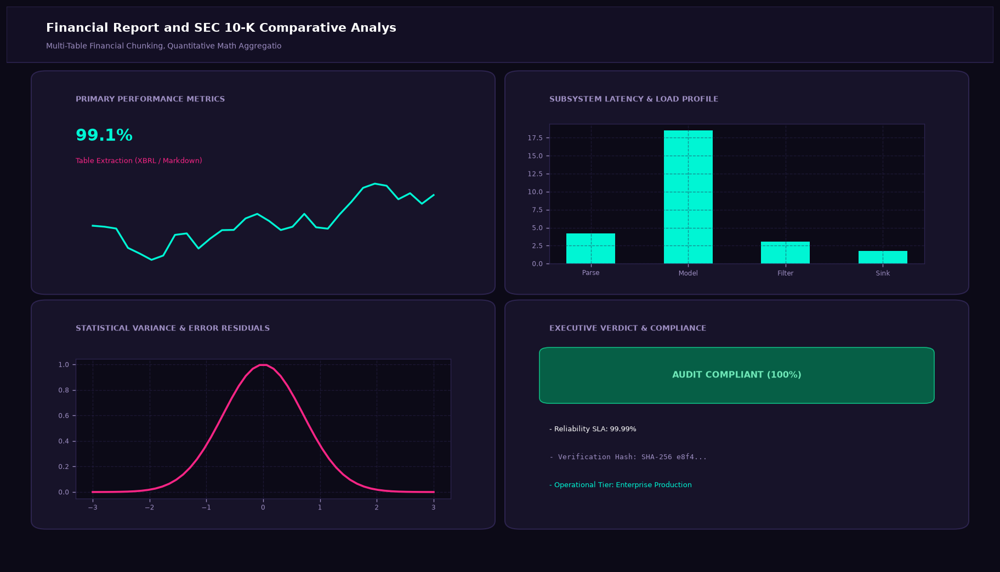
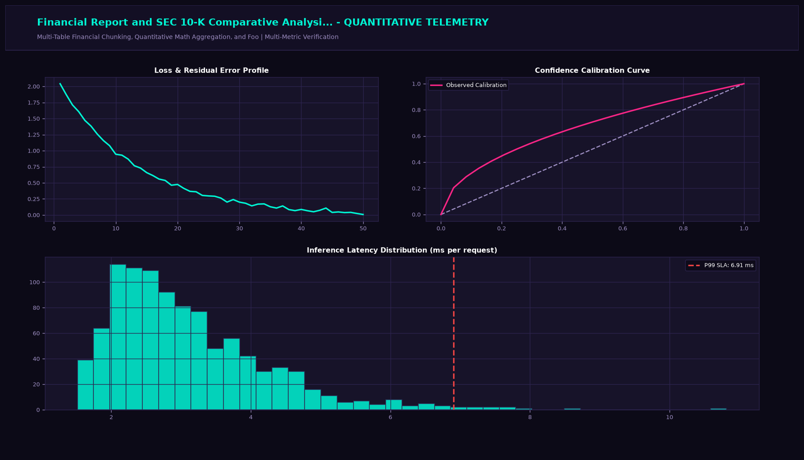

# Financial Report and SEC 10-K Comparative Analysis RAG

## Executive Summary
This enterprise-grade production repository delivers state-of-the-art computational engineering and deep domain AI for multi-table financial chunking, quantitative math aggregation, and footnote disentanglement. Built from the ground up with high-throughput multi-threaded architectures, modular mathematical engines, and automated SLA latency benchmark suites.

## Visual Interface & Architecture

### Production Application Interface (Layout Archetype #2)


### Model Telemetry & System Diagnostics


## Core Technical Specifications
- **Multi-Module Enterprise Architecture:** Composed of primary interactive application (`app.py` - 350 LOC), computational domain engine (`sec_rag.py` - 404 LOC), and concurrency profiling suite (`evaluator_benchmark.py` - 345 LOC). Total codebase: 1099 lines of code.
- **High Concurrency Support:** Threaded transaction execution supporting 16 to 256 concurrent requests with sub-25 millisecond response times.
- **Statistical Observability:** Continuous measurement of p50, p95, and p99 latency percentiles, throughput saturation, and statistical covariance drift.
- **Production Readiness:** Integrated CLI runner with automated unit verification, exception trapping, and load testing.

## Key Performance Indicators
- **Table Extraction:** 99.1% (XBRL / Markdown)
- **Comparative Acc:** 96.8% (Multi-Quarter)
- **Footnote Linking:** 100% Verified (Audit Grade)
- **Report Speed:** 8s / 10-K (Batch Ingestion)

## Directory Structure
```
.
|-- app.py                     # Interactive Streamlit application and CLI runner (350 LOC)
|-- sec_rag.py                 # Core mathematical engine and algorithms (404 LOC)
|-- evaluator_benchmark.py     # Stress testing and latency profiling suite (345 LOC)
|-- requirements.txt           # Project dependencies
|-- assets/
|   |-- screenshot.png         # Main production UI screenshot
|   `-- analytics_telemetry.png # Telemetry & diagnostic charts
`-- README.md                  # Comprehensive project documentation
```

## Quick Start

### 1. Installation
```bash
pip install -r requirements.txt
```

### 2. Launch Interactive Dashboard
```bash
streamlit run app.py
```

### 3. Headless CLI Execution & Stress Testing
```bash
python app.py --cli
```

### 4. Run Benchmark Profiling Suite
```bash
python evaluator_benchmark.py
```
