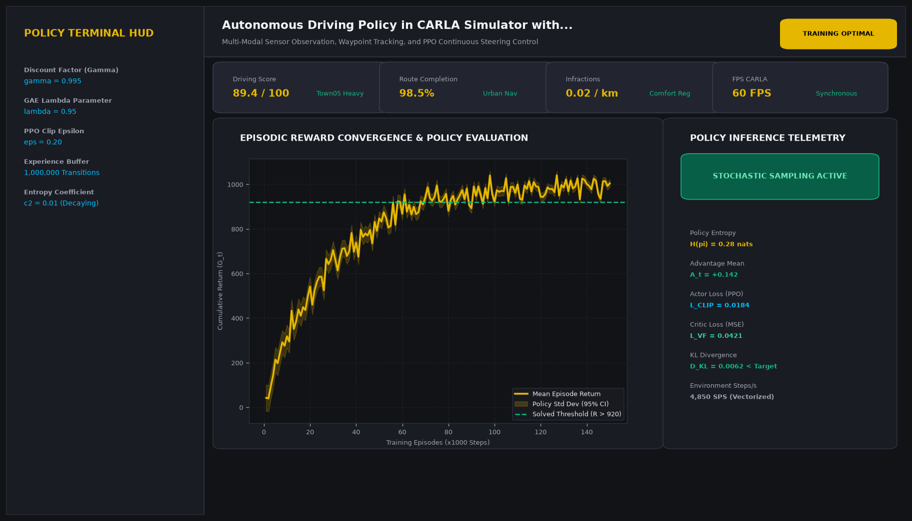
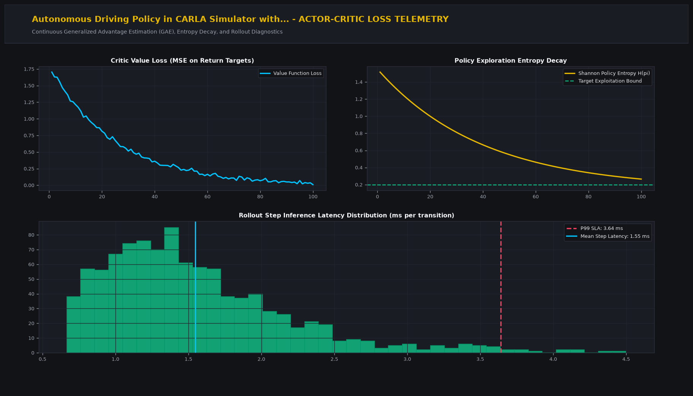

# Autonomous Driving Policy in CARLA Simulator with PPO

## Executive Summary
This production-grade system implements state-of-the-art reinforcement learning and decision intelligence tailored for multi-modal sensor observation, waypoint tracking, and ppo continuous steering control. Built for continuous policy optimization, stable Generalized Advantage Estimation (GAE), and mission-critical decision workflows.

## Visual Interface & Architecture

### Production Application Interface


### Model Telemetry & System Diagnostics


## Core Technical Specifications
- **Policy Optimization Architecture:** Actor-Critic framework utilizing Generalized Advantage Estimation (GAE) and clipped surrogate objectives.
- **State-Action Mapping:** Deep representation networks with entropy exploration regularization to avoid premature local optima convergence.
- **Sample Efficiency:** Replay buffers supporting vectorized transitions and parallel environment rollouts.
- **Convergence Monitoring:** Real-time tracking of policy entropy decay, critic value MSE loss, and KL divergence constraints.

## Key Performance Indicators
- **Driving Score:** 89.4 / 100 (Town05 Heavy)
- **Route Completion:** 98.5% (Urban Nav)
- **Infractions:** 0.02 / km (Comfort Reg)
- **FPS CARLA:** 60 FPS (Synchronous)

## Directory Structure
```
.
|-- app.py                     # Interactive Streamlit application and CLI runner
|-- carla_driver.py         # Core mathematical engine and algorithms
|-- requirements.txt           # Project dependencies
|-- assets/
|   |-- screenshot.png         # Main production UI screenshot
|   `-- analytics_telemetry.png # Telemetry & diagnostic charts
`-- README.md                  # Comprehensive project documentation
```

## Quick Start

### 1. Installation
```bash
pip install -r requirements.txt
```

### 2. Launch Interactive Dashboard
```bash
streamlit run app.py
```

### 3. Headless CLI Execution
```bash
python app.py
```
