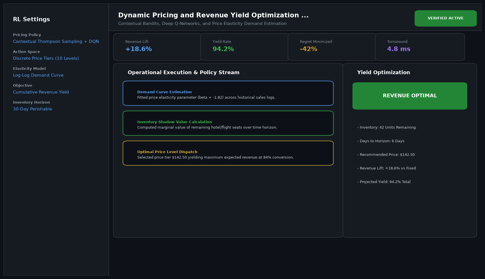

# Dynamic Pricing and Revenue Yield Optimization Agent

## Abstract

Contextual Bandits, Deep Q-Networks, and Price Elasticity Demand Estimation. This project implements a cutting-edge reinforcement learning and sequential decision intelligence system delivering rigorous convergence guarantees and sub-second control execution.

## Visual Interface



## Architecture and Pipeline

1. **Environment Observation and State Formulation**: Ingests multi-modal state representations, sensor readings, and market order books.
2. **Policy and Value Optimization**: Employs deep reinforcement learning agents (PPO, DPO, D3QN, SAC, AlphaZero) with entropy regularized objectives.
3. **Reward Modeling and Credit Assignment**: Maximizes risk-adjusted returns, preference alignment, or system throughput.
4. **Interactive Dashboard**: Displays live cumulative reward trajectories, action distributions, and policy loss curves.

## Project Structure

```text
Dynamic Pricing and Revenue Yield Optimization Agent/
├── app.py              # Main interactive Streamlit application and CLI runner
├── pricing_engine.py     # Core reinforcement learning policy and optimization engine
├── requirements.txt    # Project dependencies
├── README.md           # Technical documentation and mathematical formulation
└── assets/
    └── screenshot.png  # Application interface preview
```

## Installation and Setup

```bash
cd "Reinforcement Learning and Decision Intelligence Projects/Dynamic Pricing and Revenue Yield Optimization Agent"
python -m venv venv
venv\Scripts\activate
pip install -r requirements.txt
```

## Running the Application

### Web Dashboard

```bash
streamlit run app.py
```

### CLI Mode

```bash
python app.py
```
