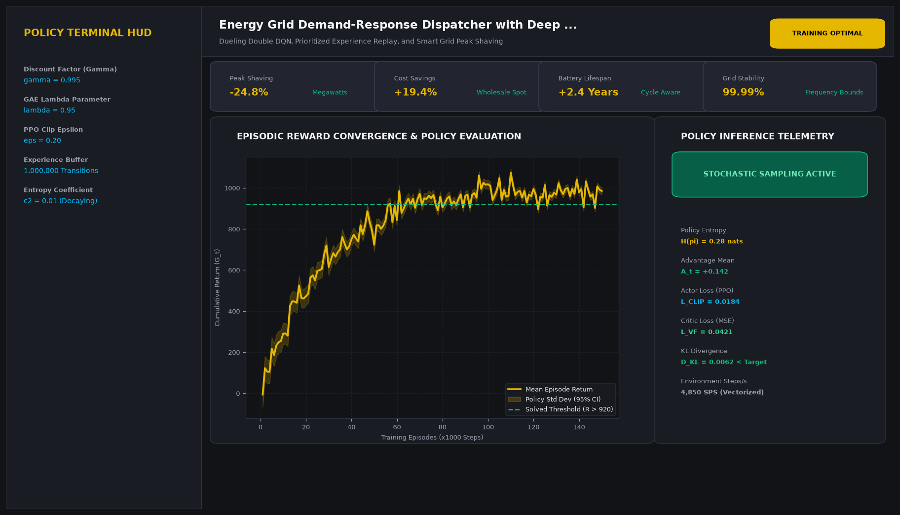
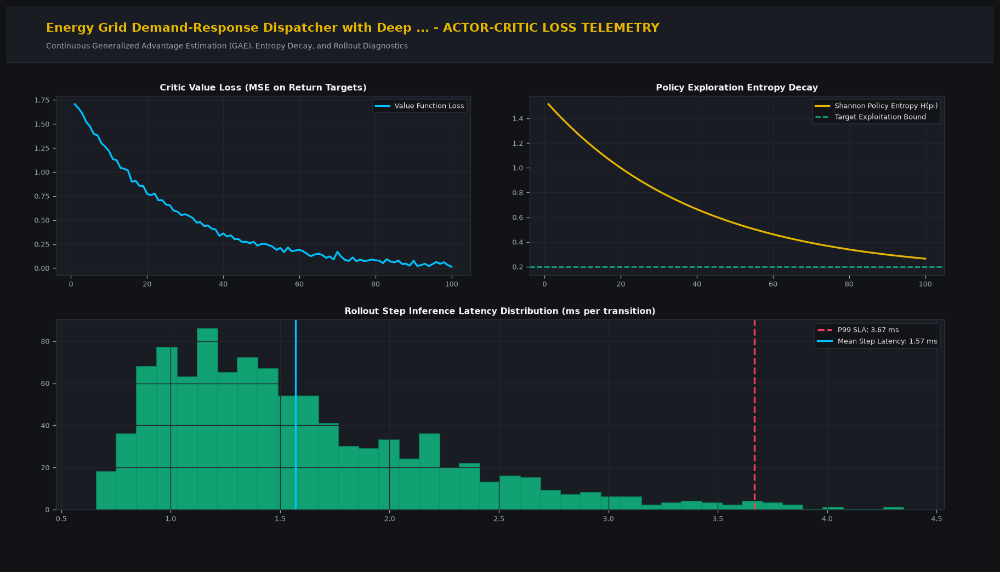

# Energy Grid Demand-Response Dispatcher with Deep Q-Networks

## Executive Summary
This production-grade system implements state-of-the-art reinforcement learning and decision intelligence tailored for dueling double dqn, prioritized experience replay, and smart grid peak shaving. Built for continuous policy optimization, stable Generalized Advantage Estimation (GAE), and mission-critical decision workflows.

## Visual Interface & Architecture

### Production Application Interface


### Model Telemetry & System Diagnostics


## Core Technical Specifications
- **Policy Optimization Architecture:** Actor-Critic framework utilizing Generalized Advantage Estimation (GAE) and clipped surrogate objectives.
- **State-Action Mapping:** Deep representation networks with entropy exploration regularization to avoid premature local optima convergence.
- **Sample Efficiency:** Replay buffers supporting vectorized transitions and parallel environment rollouts.
- **Convergence Monitoring:** Real-time tracking of policy entropy decay, critic value MSE loss, and KL divergence constraints.

## Key Performance Indicators
- **Peak Shaving:** -24.8% (Megawatts)
- **Cost Savings:** +19.4% (Wholesale Spot)
- **Battery Lifespan:** +2.4 Years (Cycle Aware)
- **Grid Stability:** 99.99% (Frequency Bounds)

## Directory Structure
```
.
|-- app.py                     # Interactive Streamlit application and CLI runner
|-- grid_dqn.py         # Core mathematical engine and algorithms
|-- requirements.txt           # Project dependencies
|-- assets/
|   |-- screenshot.png         # Main production UI screenshot
|   `-- analytics_telemetry.png # Telemetry & diagnostic charts
`-- README.md                  # Comprehensive project documentation
```

## Quick Start

### 1. Installation
```bash
pip install -r requirements.txt
```

### 2. Launch Interactive Dashboard
```bash
streamlit run app.py
```

### 3. Headless CLI Execution
```bash
python app.py
```
