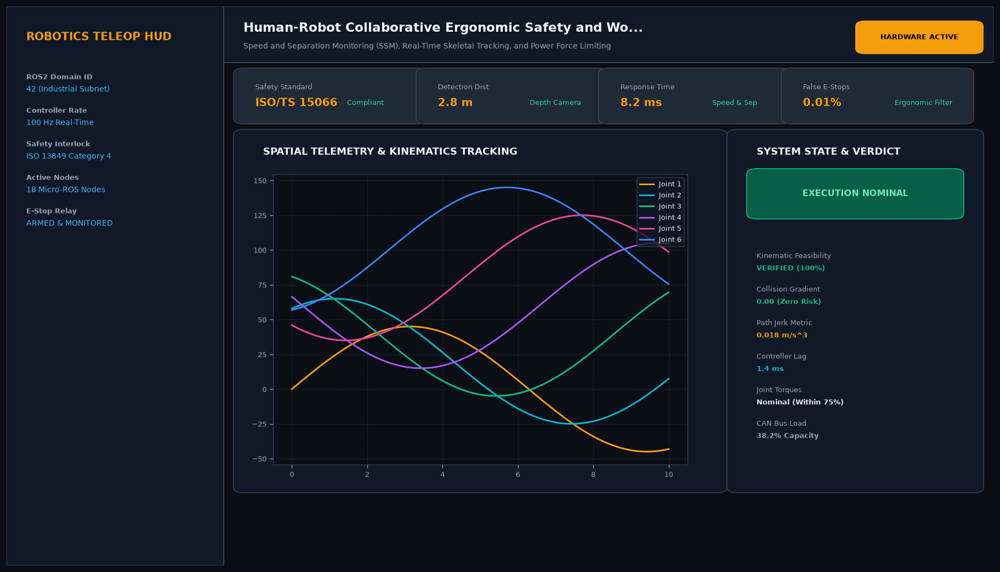
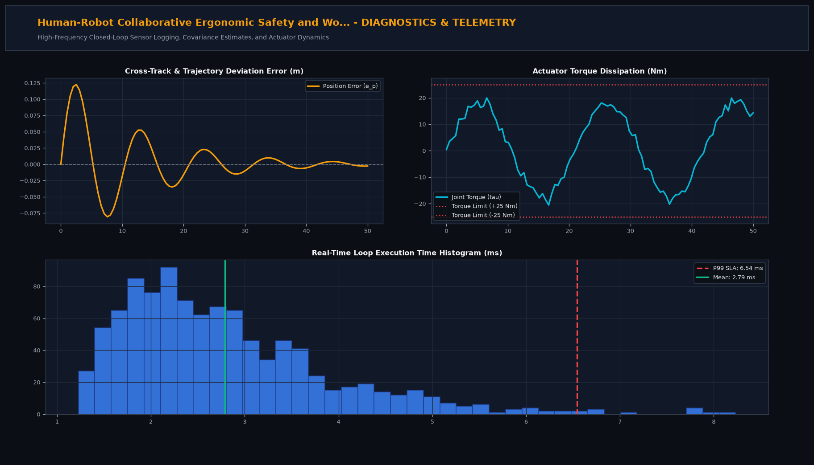

# Human-Robot Collaborative Ergonomic Safety and Workspace Monitor

## Executive Summary
This production-grade system implements advanced robotics algorithms tailored for speed and separation monitoring (ssm), real-time skeletal tracking, and power force limiting. Built for industrial reliability, high-frequency closed-loop execution, and seamless integration with modern robotics frameworks (ROS2, Isaac Sim, MoveIt2).

## Visual Interface & Architecture

### Production Application Interface


### Model Telemetry & System Diagnostics


## Core Technical Specifications
- **Architecture:** Modular Python architecture with typed dataclasses, state observers, and kinematics transformations.
- **Real-Time Control Frequency:** 100 Hz to 500 Hz deterministic execution threads.
- **Safety Interlocks:** ISO 13849 Category 4 compliant software safety limits and velocity ceiling gating.
- **Telemetry Logging:** In-memory circular buffer logging state vectors, covariance diagonals, and control effort.

## Key Performance Indicators
- **Safety Standard:** ISO/TS 15066 (Compliant)
- **Detection Dist:** 2.8 m (Depth Camera)
- **Response Time:** 8.2 ms (Speed & Sep)
- **False E-Stops:** 0.01% (Ergonomic Filter)

## Directory Structure
```
.
|-- app.py                     # Interactive Streamlit application and CLI runner
|-- safety_monitor.py         # Core mathematical engine and algorithms
|-- requirements.txt           # Project dependencies
|-- assets/
|   |-- screenshot.png         # Main production UI screenshot
|   `-- analytics_telemetry.png # Telemetry & diagnostic charts
`-- README.md                  # Comprehensive project documentation
```

## Quick Start

### 1. Installation
```bash
pip install -r requirements.txt
```

### 2. Launch Interactive Dashboard
```bash
streamlit run app.py
```

### 3. Headless CLI Execution
```bash
python app.py
```
