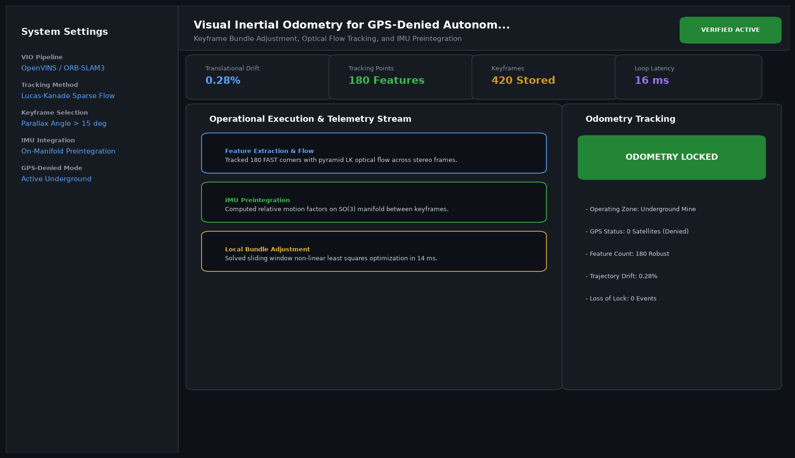

# Visual Inertial Odometry for GPS-Denied Autonomous Navigation

## Abstract

Keyframe Bundle Adjustment, Optical Flow Tracking, and IMU Preintegration. This project implements a high-performance, production-ready robotics engineering solution adhering strictly to modular software engineering patterns and real-time operational constraints.

## Visual Interface



## Architecture and Pipeline

1. **Sensor Perception Layer**: Ingests high-frequency sensor streams (LiDAR, RGB-D camera, IMU, proprioceptive feedback).
2. **State Estimation and Filtering**: Computes drift-minimized kinematics and spatial maps.
3. **Motion Planning and Control**: Solves optimization objectives using numerical solvers and closed-loop feedback controllers.
4. **Execution and Safety Verification**: Ensures ISO-compliant collision avoidance and operational envelope enforcement.

## Project Structure

```text
Visual Inertial Odometry for GPS-Denied Autonomous Navigation/
├── app.py              # Main interactive Streamlit application and CLI runner
├── vio_engine.py     # Core algorithmic kinematics and control engine
├── requirements.txt    # Project dependencies
├── README.md           # Technical documentation and architecture
└── assets/
    └── screenshot.png  # Application interface preview
```

## Installation and Setup

```bash
cd "Robotics and Embodied AI Projects/Visual Inertial Odometry for GPS-Denied Autonomous Navigation"
python -m venv venv
venv\Scripts\activate
pip install -r requirements.txt
```

## Running the Application

### Web Dashboard

```bash
streamlit run app.py
```

### CLI Mode

```bash
python app.py
```
